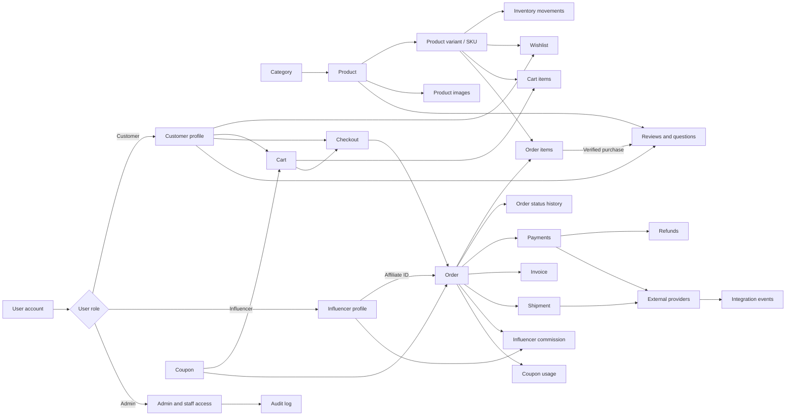
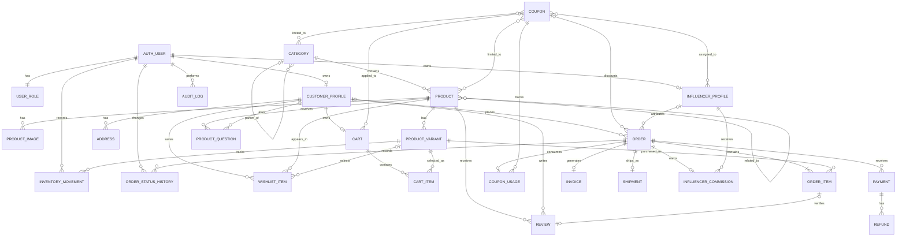
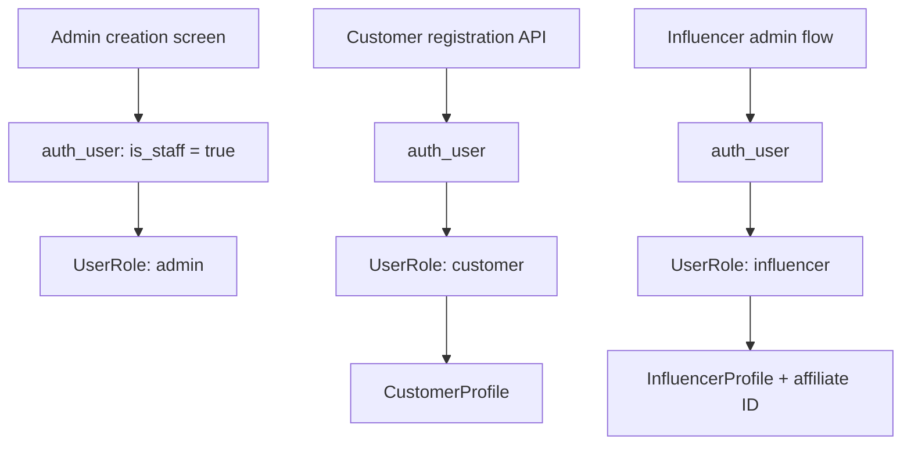

# FABRIQX Database and Business Flow

This document reflects the Django models currently implemented in the project.
Most business tables are defined in `fabriqx/models.py`. The `customers`,
`products`, `influencers`, and `content_management` apps use proxy models to
organize the Django admin and do not create duplicate database tables.

## End-to-end business flow

## Entity relationship diagram

## Main table responsibilities

| Area | Tables/models | Purpose |
|---|---|---|
| Authentication | `auth_user`, `UserRole` | Login identity and Admin, Customer, or Influencer role |
| Customers | `CustomerProfile`, `Address`, `WishlistItem` | Customer information, delivery/billing addresses, saved products |
| Catalog | `Category`, `Product`, `ProductImage`, `ProductVariant` | Hierarchical catalog, merchandising, images, SKU/size/color and pricing |
| Inventory | `InventoryMovement` | Auditable stock increases, sales, returns, adjustments, and damage |
| Shopping | `Cart`, `CartItem` | One active cart per customer and its selected SKUs |
| Promotions | `Coupon`, `CouponUsage` | Coupon rules, applicability, attribution, and usage history |
| Orders | `Order`, `OrderItem`, `OrderStatusHistory` | Checkout snapshot, purchased SKUs, totals, and status trail |
| Finance | `Payment`, `Refund`, `Invoice` | Gateway transactions, refunds, reconciliation, and invoices |
| Fulfilment | `Shipment`, `ServiceablePincode` | Courier tracking and delivery availability |
| Influencers | `InfluencerProfile`, `InfluencerCommission` | Affiliate IDs, commission rules, order attribution, and payouts |
| Engagement | `Review`, `ProductQuestion` | Moderated reviews, verified purchases, and product Q&A |
| CMS | `Banner`, `HomepageSection`, `Testimonial`, `NewsletterSubscription` | Storefront-managed content and newsletter audience |
| Operations | `IntegrationEvent`, `AuditLog` | External API/webhook history and admin activity history |

## Important data rules

- Every user has one `UserRole`. Admin users receive staff access; customer and
  influencer users are created through their dedicated flows.
- A product belongs to one category and has one or more SKU variants. Stock is
  held on `ProductVariant`, while every adjustment is recorded in
  `InventoryMovement`.
- Address data and item names/prices are copied into an order so historical
  orders remain accurate if catalog or customer data later changes.
- An order can have multiple payment attempts and refunds, but only one invoice,
  shipment, coupon-usage record, and influencer-commission record.
- Affiliate IDs connect an order to an active influencer. Commission may be a
  percentage of the eligible amount or a fixed amount.
- `SalesReport`, `InventoryReport`, and `InfluencerReport` are proxy models used
  for reporting screens; they do not create separate database tables.
- Orders, payments, and marketing models currently remain registered but are
  temporarily hidden from the Django admin sidebar.

## Current database path by user type

